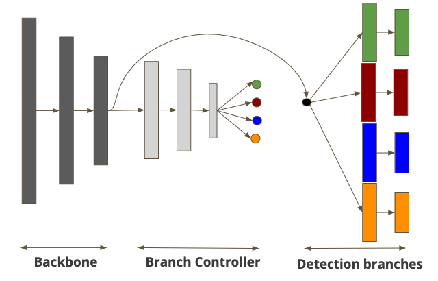

# Adaptive_YOLO
Work in-progress to reduce the model size for Object Detection using adaptive techniques.

## Abstract

## 1. Baseline - Object Detection using Yolo
This is the baseline, for training use 
`python3 train.py --model_def config/yolov3-tiny.cfg --data_config config/coco.data --epochs 200 --batch_size 128`
for testing run 
`python3 test.py --model_def config/yolov3-tiny.cfg --data_config config/coco.data --weights_path checkpoints/yolov3_tiny.pth --batch_size 1`

## 2. Adaptive Object Detection 
Our adaptive model has 3 main parts: backbone, detection head and branch controller as shown in the figure bellow.

We experimented two different training techniques for the backbone, detection and the branch controller.

### Method 1
In this method, we do simultanous training of backbone and detection head followed by training the branch controller.

#### Simulaneously training the backbone and the detection head
To Train the backbone and detection head using this method, you need:

1. Define the model architecture - we defined two sample model architectures: [Yolov3_ada6.cfg](https://github.com/scale-lab/Adaptive_YOLO/blob/master/config/yolov3-ada6.cfg) for 6-class subset of MS COCO dataset and [Yolov3_ada.cfg](https://github.com/scale-lab/Adaptive_YOLO/blob/master/config/yolov3_ada.cfg) for the full MS COCO dataset.

2. Run the training using - `python3 ada_train.py --model_def config/yolov3_ada.cfg --data_config config/coco.data --clusters_path clusters.data --epochs 60 --batch_size 128`

3. Explore more parameters for training by running `python3 ada_train.py --help`

#### Training the Branch Controller 
1. Define the classifier architecture - we define a sample classifier architecture [here](https://github.com/scale-lab/Adaptive_YOLO/blob/master/config/hier_clus.cfg)

2. Run the training using `python3 train_hier_classifier.py --model_def config/hier_clus.cfg --data_config config/coco.data --clusters_path clusters_3b.data --ckpt_prefix "bnch3" --epochs 100 --batch_size 128`

#### Testing the Adaptive Model
The model can be tested under few different conditions:

1. Get the Oracle for your model: This is the highest bound of the backbone and detection head, we do this by assuming a perfect branch controller. You can get the Oracle accuracy by setting the max_bound option `--max_bound True` in the testing command. Example: `python3 ada_test.py --model_def config/yolov3_ada.cfg --data_config config/coco.data --clusters_path clusters.data --weights_path weights.pth --batch_size 1 --max_bound True`

2. To use the branch controller, you should set `--hier_class True` and you should provide the branch controller model using `--hier_model_cfg` option as well as the weights for the branch controller using the `--hier_model` option. Example `python3 ada_test.py --model_def config/yolov3_ada.cfg --data_config config/coco.data --clusters_path clusters.data --weights_path weights.pth --batch_size 1 --hier_class True --hier_model_cfg config/hier_clus.cfg --hier_model branch_controller.pth`

### Method 2
In this method we train the backbone, each branch and the branch controller individually.

This is a fork from [PyTorch_YOLOv3](https://github.com/eriklindernoren/PyTorch-YOLOv3)
